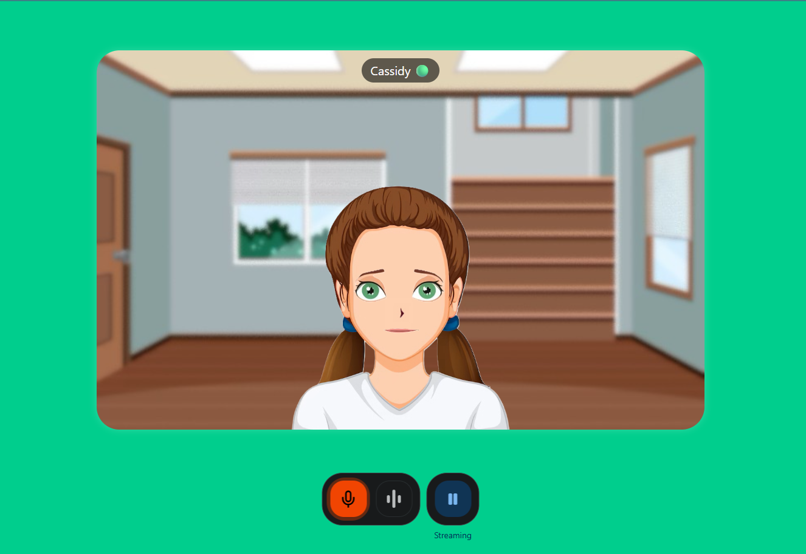

# Cassidy
Cassidy is a cute 2d talking avatar. She can talk with you live using gemini-2.5-live.


# Installation
1. Clone the repository:
   ```bash
   git clone https://github.com/HemantKumar01/Cassidy-Talking-Avatar.git
   cd Cassidy-Talking-Avatar
   ```
2. Install the required packages:
   ```bash
   npm install
   ```
3. Create a `.env` file in the root directory and add your Gemini API key:
   ```plaintext
    NEXT_PUBLIC_GEMINI_API_KEY=YOUR_GEMINI_API_KEY
    ```
4. Start the development server:
    ```bash
    npm run dev
    ```
